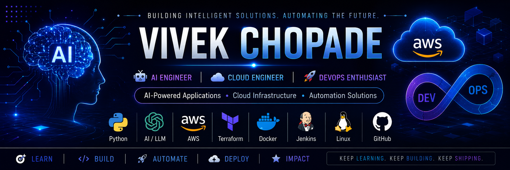

  

<h1 align="center">Hi 👋, I'm Vivek Chopade</h1>

<h3 align="center">
🤖 AI Engineer | ☁️ Cloud Engineer | 🚀 DevOps Enthusiast
</h3>

Building AI-Powered Applications, Cloud Infrastructure & Automation Solutions

Python • Generative AI • AWS • Terraform • Docker • Jenkins • Linux

---

## 🚀 About Me

🎓 Pursuing **Master of Computer Applications (MCA)**

🤖 Passionate about **Artificial Intelligence, Generative AI, Cloud Computing and DevOps**

☁️ Hands-on experience with **AWS Cloud, Infrastructure as Code, Automation and CI/CD Pipelines**

🚀 Building intelligent applications, cloud infrastructure and automation solutions

🐧 Linux enthusiast with a strong interest in scalable architectures and modern DevOps practices

🌱 Currently learning **Generative AI, AI Agents, MLOps and Advanced AWS Services**

---

## 🏆 Certifications

* ✅ AWS Cloud Practitioner Essentials – Amazon Web Services
* ✅ MCA Master in Cloud Architecture – Fortune Cloud

---

## 🤖 Featured AI Projects

### 🔍 DevOps AI Code Reviewer

* AI-powered code review platform
* Code quality analysis
* Intelligent recommendations
* Flask + Python + AI

### 📄 AI Resume Analyzer

* ATS Resume Scoring
* Resume Skill Gap Detection
* AI Suggestions
* Flask + MySQL + OpenAI

### 🎯 AI Career Assistant

* Career Roadmap Generator
* Interview Question Generator
* Skill Recommendation Engine

---

## ☁️ Featured Cloud & DevOps Projects

| Project                                    | Description                                         |
| ------------------------------------------ | --------------------------------------------------- |
| ☁️ Terraform 3-Tier AWS Architecture       | Production-ready AWS infrastructure using Terraform |
| 🐍 Flask EC2 Deployment                    | Flask deployment using Gunicorn & NGINX             |
| ⚙️ Jenkins Setup on AWS EC2                | CI/CD automation using Jenkins                      |
| 🌦️ Serverless Weather Notification System | Lambda + SNS + EventBridge                          |
| 🌐 WordPress Hosting on AWS                | AWS EC2 + NGINX + MySQL                             |
| 🔄 Node.js CI/CD Pipeline                  | Automated deployments using Jenkins                 |

---

## 🛠️ Tech Stack

### 🤖 AI & Machine Learning

Generative AI • Prompt Engineering • OpenAI API • AI Automation • LLM Applications

### ☁️ Cloud Computing

AWS EC2 • S3 • Lambda • RDS • IAM • SNS • VPC

### 🚀 DevOps & Automation

CI/CD • Infrastructure as Code • Automation

### 💻 Development

---

## 🌱 Currently Learning

* 🤖 Generative AI
* 🤖 AI Agents
* ☁️ Advanced AWS
* ☸️ Kubernetes
* 🔐 Cloud Security
* 🚀 MLOps

---

## 🌐 Connect With Me

---

## 💭 Quote

⭐ **Keep Learning. Keep Building. Keep Shipping.**

🚀 **Turning Ideas into Intelligent Cloud Solutions.**
